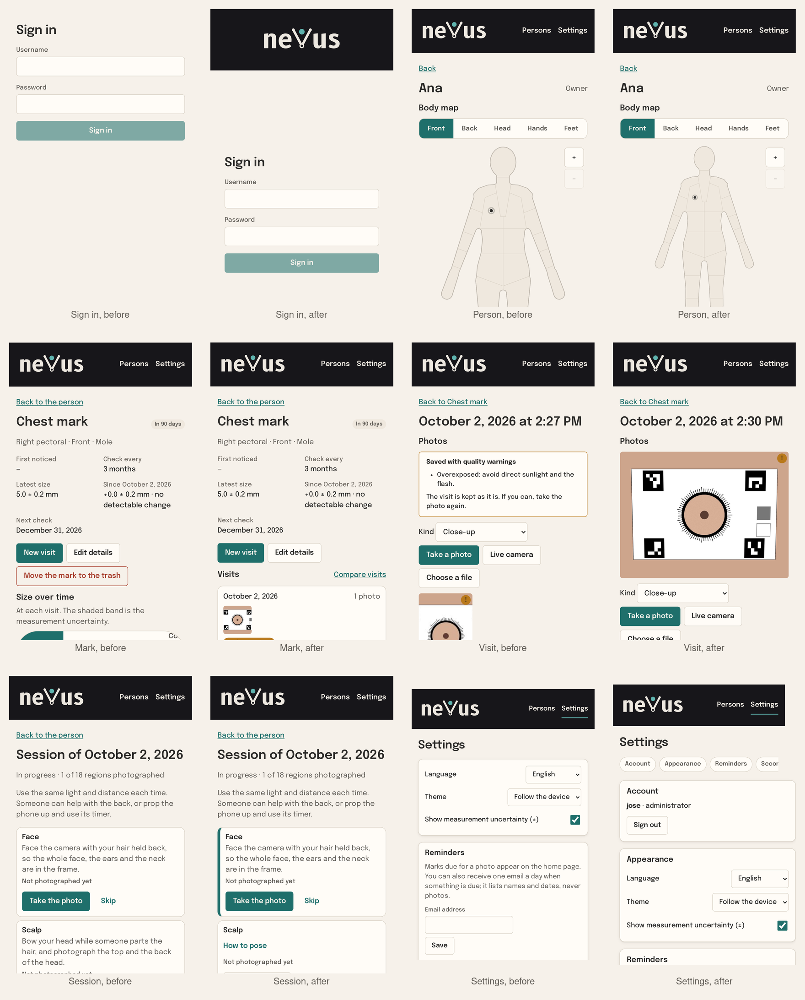
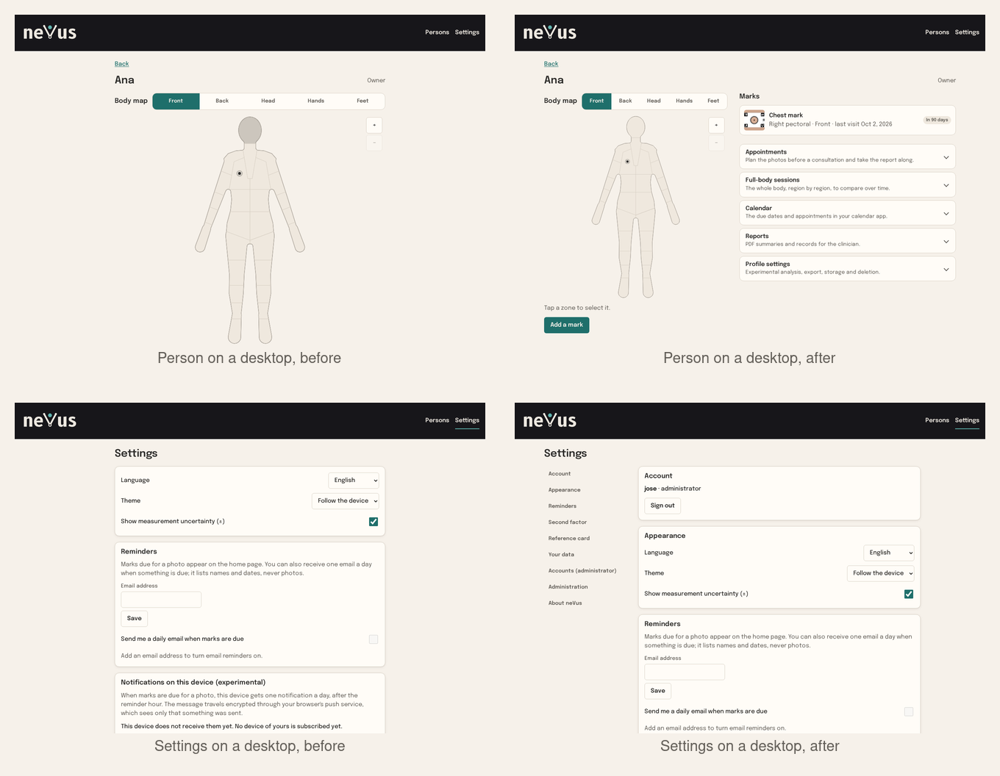
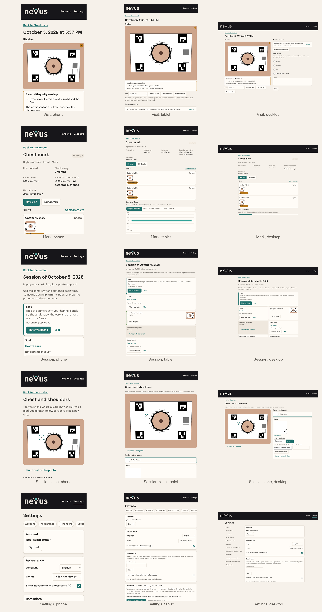

# Design review: every screen, 2026-10-02

A graphic designer's pass over the interface as it stood at 1.0.0, made with the screenshot gallery (`pnpm run shots`: every screen on a phone and on a desktop, light and dark) and the method of the design brief. It names what each screen must do, what was in the way, and what changed in 1.1.0. The brief itself is [`DESIGN_BRIEF.md`](DESIGN_BRIEF.md); this document is the review of what was built against it.

## Brief for the screens

- **Communicate:** observation, continuity, precision. **Never suggest:** alarm, a clinic, an emergency.
- **Where it lives:** a phone held in one hand (390 px wide, the thumb reaching the lower half) and a desktop window of 1280 px or more. Every screen must work on both.
- **Fixed:** the warm palette with one calm accent, Epilogue, the wordmark on dark paper, calm copy, a single accent for the selected element.
- **The Product Owner's words:** calm, not clinical, symmetric letterforms; and today, *optimise how information and the user's action are arranged and placed*.

## What the gallery showed

Six patterns, across screens:

1. **One long column everywhere.** The person page scrolled over 7,500 px on a phone: body map, marks, appointments, sessions, calendar, reports, profile, export and deletion, each spelled out in full with its own introduction. On a desktop the same column sat in the middle of an empty window.
2. **Too many primary actions.** The person page had five teal buttons (add a mark, prepare the appointment, start a session, make a calendar link, make the summary); the session page had eighteen (one per region). A primary button is a claim about what matters most; many claims cancel each other.
3. **Destructive actions next to the main ones.** "Move the mark to the trash" sat under "New visit"; "Move visit to trash" sat beside "Save". A slip of the thumb would have undone work.
4. **The photograph was not the hero.** On the visit page the photo was a 120 px thumbnail under a quality warning, a kind selector and three buttons; the brief says the photograph is the hero and the interface stays out of its way.
5. **The first action below the fold.** The body map filled the phone's viewport, so the hint and "Add a mark" were out of sight and out of the thumb's reach.
6. **Sign-in without the brand, sign-out at the end.** The sign-in pages were a bare form in the top-left corner; the settings page put the account and "Sign out" after every other card.

The things that were right stayed: the palette and its contrast, the type scale, the calm copy, cards for settings groups, badges in amber rather than red, the compare and measure tools, the empty states.

## Rules that came out of it

- **One primary action per screen**, placed where the eye and the thumb arrive after reading the content it acts on. Everything else is secondary (outlined) or quiet (text).
- **Destructive actions stand apart**: at the end of the page, behind a hairline, never in the row of the primary action.
- **Occasional tools fold.** A tool used once a season (appointments, sessions, calendar, reports, profile) shows its title and one line, and opens on demand; it opens by itself when something inside is live (an appointment ahead, a session in progress).
- **The content's own order.** A mark page is its visits first, then the trend, then the tools; a visit page is its photographs first, large, then what was measured on them, then the notes.
- **Two panes when there is room.** From 900 px the person page puts the body map on the left, sticky, and the marks and tools on the right; the settings page puts the list of sections on the left and the sections on the right.
- **The brand frames the entrance.** Sign-in pages carry the wordmark on its dark paper above a centred form and the tagline below, as the brief asked.

## Screen by screen

| Screen | Was | Now |
| --- | --- | --- |
| Claim, sign in, second factor, recovery | A form in the top-left corner of an empty page; no brand. | The wordmark on dark paper above, the form centred in the page, the tagline below; the `main` landmark kept. |
| Home | Due strip, then persons. | Unchanged. |
| Person | One column of eight sections; five primary buttons; the map taller than the viewport, the action below the fold. | Two panes from 900 px (map sticky left, marks and tools right). The map leaves room under it for the hint and "Add a mark", the one primary action. Appointments, sessions, calendar, reports and profile fold under their titles with a one-line hint; appointments open when one is ahead, sessions when one is in progress. |
| Person, placing a mark | Asked for a zone even when one was selected. | A selected zone is where the mark goes: the map zooms in on it and asks for the exact spot (fixed earlier today, with deselecting by tapping again or outside the body). |
| Mark | Chart, sightings and reports before the visits; the trash button beside "New visit". | Visits first, with "New visit" as the one primary action; then size over time, sightings, reports; the trash action last, apart, behind a hairline. |
| Visit | A quality warning, a kind selector and three buttons before a 120 px thumbnail; "Move visit to trash" beside "Save". | The photographs first, the first one the width of the page and never cropped; the quality note as its caption; the controls after; the trash action last, apart. |
| Measure | A two-step tool with its own panel. | Unchanged. |
| Compare | Selectors, views, synced photos. | Unchanged. |
| Session | Eighteen regions, each with its pose text and a primary button. | The next region to photograph leads, with its pose and the one primary button; the others keep their status and fold their pose under "How to pose". |
| Session zone, blur, sessions compare | Photo, marks, panel. | Unchanged. |
| Settings | Twelve cards in one column; the account and "Sign out" at the end; the first card without a heading. | The account first (name, role, sign out); every group with a heading; a list of the sections to jump to, as a row of pills on a phone and a sticky column from 900 px. |
| Trash, evaluation | Lists and a labelling tool. | Unchanged. |

## Boards

The first screen of each key page, before and after, at one scale:

The whole gallery is reproduced by `pnpm run shots` at any commit; the before set is the tree of `v1.0.0`. Two measures of the change on a phone: the person page went from 8,111 px to 4,113 px of scrolling, the session page from 10,563 px to 9,702 px; the settings page grew by a card (the account) and a row (the sections). The accessibility sweep of the gallery stays at zero findings.

## Second pass, 2026-10-05

Every screen again, at full size this time, on a phone and on a desktop (and, from this pass on, on a tablet: the gallery photographs three devices). What the first pass had left:

| Screen | Found | Changed |
| --- | --- | --- |
| Home | The due strip, a second-level heading, sat above the page's title. | The title and "Add a person" first; then what is due and the coming appointments; then the persons. |
| Mark | The reports kept a second primary button on the page; the chart's metric control overflowed the phone's width ("Colour contrast with the skin" cut off); the facts grid broke "since" into a narrow column on a desktop. | Reports fold under their title, as on the person page; the metric control wraps and the label is "Colour contrast"; the facts' columns are wider. |
| Visit | The quality note had landed after the controls and the privacy note, far from the photograph; three primary buttons (take a photo, measure, save); one long column on a desktop. | The note is the photograph's caption; the primary action follows the state (take a photo until there is one, measure until there is a measurement, save when something changed); from 900 px the photographs sit on the left, sticky, and the measurements and notes on the right. |
| Session | Eighteen regions in one column on a desktop. | Two columns from 900 px; the next region spans both. |
| Session zone | Photo, marks and panels in one column on a desktop. | From 900 px the photograph sits on the left, sticky, the marks and their panels on the right. |
| Settings | Fourteen cards in one column, 13,900 px on a phone; the administrator's groups the longest. | The occasional and administrative groups fold under their titles with a hint (second factor, reference card, your data, accounts, email delivery, webhooks, backups, instance); the list of sections opens the one it points to; account, appearance and reminders stay open. |
| Sign in | The wordmark larger than in the shell. | The shell's size. |

New rules from this pass: the primary action is a function of the page's state, not a fixed button; a control with several options wraps rather than overflows; a group of settings used once a season folds like a tool.

The five screens that changed most, after the pass, on the three devices the gallery photographs:

On a phone the settings page went from 13,873 px to 6,846 px of scrolling. The accessibility sweep stays at zero findings on all three devices.

## Deferred, for a decision

The brief proposed a bottom navigation bar on phones (Map, Due, Add, Visit). The interface has a top bar (Persons, Settings) and the person page as the hub, and this pass keeps it: the hub carries the one primary action within the thumb's reach, and a bottom bar would duplicate what the person page now does. The question for the Product Owner, with a default:

- **Keep the top bar** (default): nothing more to build; revisit when a second hub (for example a "due" page across persons) exists.
- Add a bottom bar with Persons, Due and Settings on phones only.
- Add a bottom bar with the brief's four destinations, which needs a "Due" page and a capture entry point outside a mark.
