# Brand sketches — round 2

The first round (converging lines, time rings, typographic V; wordmark in a humanist face) was declined by the Product Owner on 2026-09-23; the colours were approved. This round keeps the palette (paper `#F6F1EA`, ink `#2B2A28`, accent `#1F6F6B`), makes every mark symmetric about its vertical axis, and offers the wordmark in geometric typefaces whose letterforms are as symmetric as the request asks for: mirrored n and u, a symmetric V, a round e, a rotationally symmetric s. The declined sketches are kept in [`round-1/`](round-1/) for reference.

## Marks

| D — loupe | E — five observations | F — focus frame |
| --- | --- | --- |
|  |  |  |
| A lens on a V-shaped stand with the mark at its centre: look closely, hold steady. The V is the stand; the circle is the loupe and the lesion outline; the dot is the mark. | Five observations over time converge on the mark. The V is drawn by the dots themselves; the accent dot at the vertex is the lesion. Reduces to three dots at favicon size. | A camera focus frame around the mark: photograph, frame, compare. No letter, pure act of observation; the rounded corners echo the reference card. |

All three read at 16 px on a light or dark tab bar (a dark variant swaps paper and ink and keeps the accent) and scale to the 512 px app icon and the store card without change.

## Wordmark candidates

Each wordmark is the word set in the typeface and converted to outlines, so it renders identically everywhere; kerning is approximated with uniform tracking and will be refined for the chosen face. All typefaces are under the SIL Open Font License 1.1 and will be self-hosted. Weight 600 unless noted (Comfortaa and Quicksand at 700).

| Typeface | Wordmark | Notes |
| --- | --- | --- |
| **Jost** | 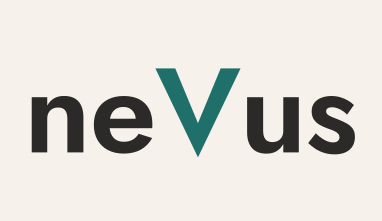 | Futura lineage: n and u are mirror images, V and s symmetric, e a true circle cut. The most geometric of the set; slightly narrow. |
| **Outfit** | 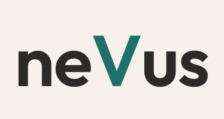 | Even, quiet geometric with generous round e and u; reads calm at small sizes. |
| **Urbanist** | 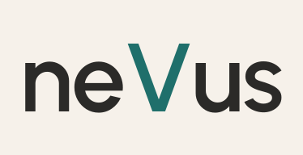 | Low-contrast geometric, very regular rhythm; the V is wide and stable. |
| **Poppins** | 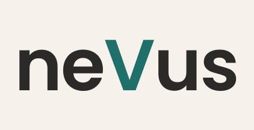 | Classic geometric with round counters; friendlier and a little heavier. |
| **DM Sans** | 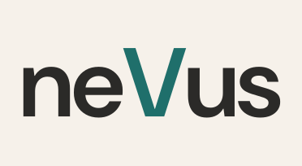 | Geometric with a touch of warmth in s and e; strong on screens at text sizes too. |
| **Josefin Sans** | 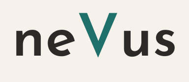 | Geometric with a low x-height and long ascenders; elegant, more distinctive, less neutral. |
| **Comfortaa** | 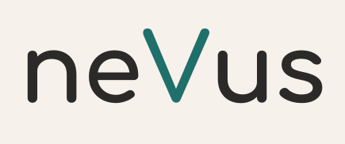 | Rounded geometric, almost monoline; the softest and most symmetric letterforms, playful by nature. |
| **Quicksand** | 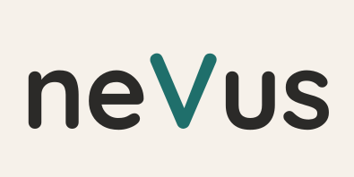 | Rounded geometric, lighter than Comfortaa; friendly. |
| **Montserrat** | 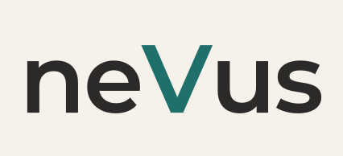 | Wider geometric grotesque; solid and familiar. |
| **Red Hat Display** | 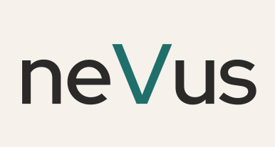 | Geometric display face with slightly squarer round forms. |
| **Lexend** | 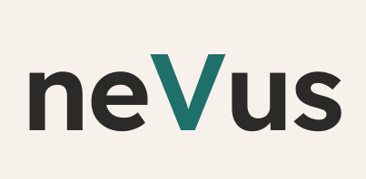 | Designed for reading fluency; geometric skeleton with open shapes. |
| **Figtree** | 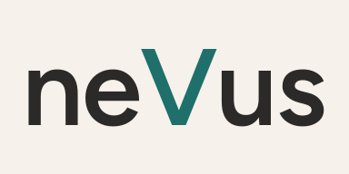 | Friendly geometric, balanced widths. |

The chosen typeface also becomes the interface face where its legibility at text sizes allows; otherwise a companion text face is paired with it and documented in the design brief.
