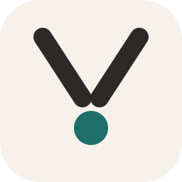
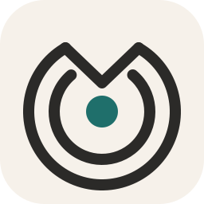
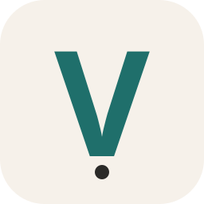
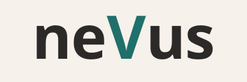

# Brand sketches

Three directions for the neVus mark, all anchored on the capital V of the wordmark ("nevus vs. us"). These are working sketches for the Product Owner to choose from, drawn in the working palette (paper `#F6F1EA`, ink `#2B2A28`, accent `#1F6F6B`). The chosen direction will be refined for 16, 32, 180 and 512 px, the store card and the report header.

| A — converging V | B — time rings | C — typographic |
| --- | --- | --- |
|  |  |  |
| Two lines of sight converge on the mark under watch. Reads as V, as a reticle and as attention. Survives 16 px. | Concentric rings for the observations over time; the rings open into a V above the mark. Communicates continuity; the rings soften below 32 px. | The V alone, set in the wordmark's face, with a small mark beneath it. Minimal and flexible; as an app icon it stays a letter. |

Wordmark:

Notes for the refinement:

- The V is the only element that carries the accent colour when combined with the wordmark; the mark never uses red.
- Line weights are set so that the mark reads at 16 px on a light or dark tab bar; a dark variant swaps paper and ink and keeps the accent.
- The typographic sketch depends on the final typeface; it is approximate until the face is chosen.
