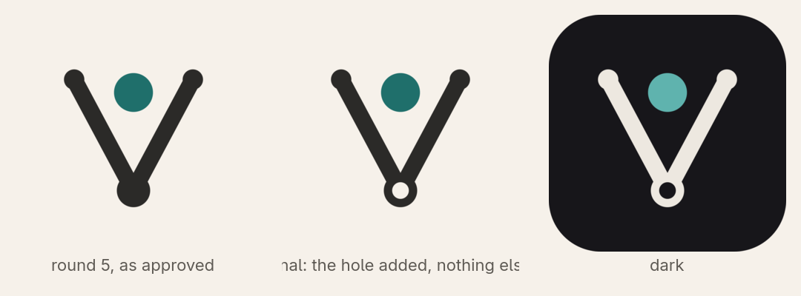
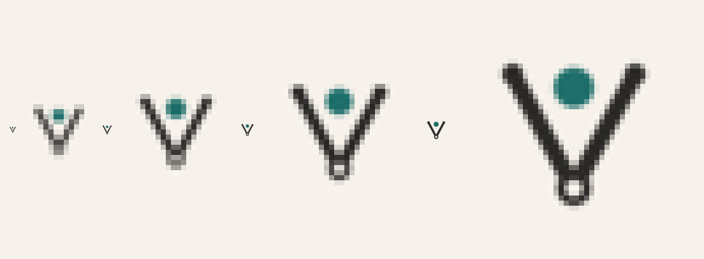
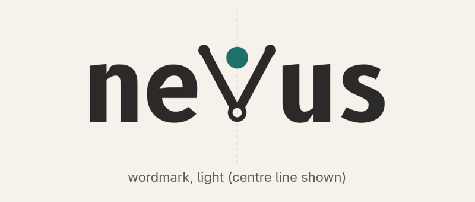
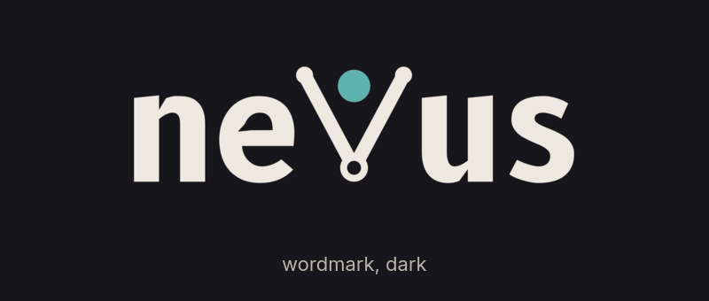
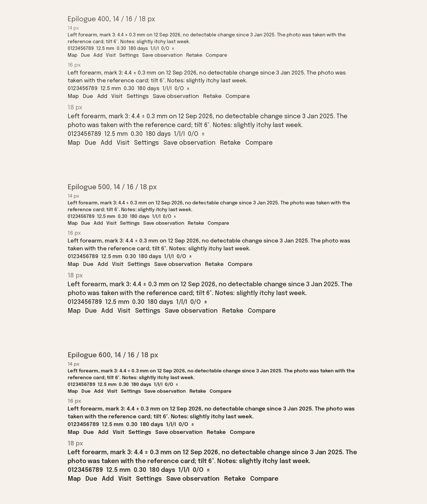
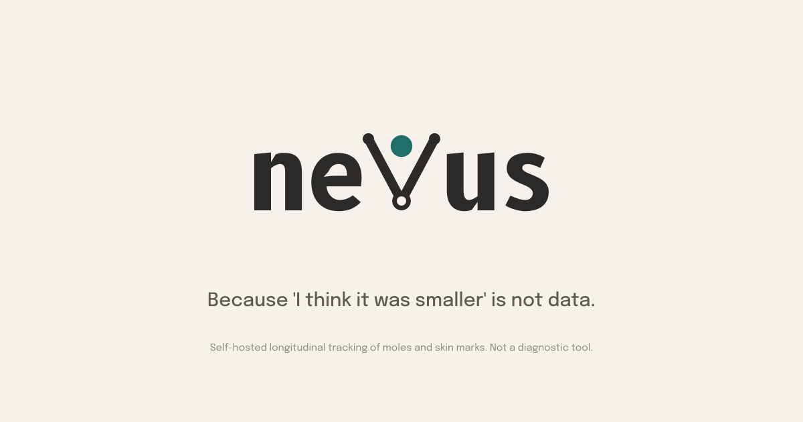

# neVus identity

Settled on 2026-09-23 after five rounds (history in [`../README.md`](../README.md)). Everything here is generated from the sources in [`sources/`](sources/); change the parameters, not the drawings.

## The mark

A divider, the measuring compass, holding the mark between its points. The legs are the V of the name, the hinge at the vertex is a disc with a hole of exactly half its diameter in the inverse colour, and the mark between the points is the only accent. The drawing is the one approved in round 5 (stroke 18 on the 256 grid, tips of radius 11, hinge of radius 18), with the hole (radius 9) as the only addition; a pixel comparison against the round-5 file shows no other difference. Symmetric to the pixel.

At 16, 24, 32 and 48 px (real size and enlarged):

Files: [`svg/mark.svg`](svg/mark.svg) (light container), [`svg/mark-dark.svg`](svg/mark-dark.svg), [`svg/mark-bare.svg`](svg/mark-bare.svg) and [`svg/mark-bare-dark.svg`](svg/mark-bare-dark.svg) (no container, for lockups and headers); PNG icons in [`icons/`](icons/) at 16, 32, 48, 180, 192 and 512 px.

## The wordmark

`neVus` set in **B612 Bold**, with the mark standing in for the V, unchanged: the letter box of the mark (from the tips to the bottom of the hinge) is mapped to the cap height, the mark sits 0.03 em into its neighbours like a kerned V, and the whole word is optically centred so the mark's axis is the exact centre of the ink box (191.0 px of ink on the left against 183.4 px on the right before centring; equal after).

Files: [`svg/wordmark.svg`](svg/wordmark.svg), [`svg/wordmark-dark.svg`](svg/wordmark-dark.svg), [`svg/wordmark-transparent.svg`](svg/wordmark-transparent.svg), [`svg/wordmark-transparent-dark.svg`](svg/wordmark-transparent-dark.svg). Outlines only; no font is needed to render them. Metrics in [`sources/wordmark-metrics.json`](sources/wordmark-metrics.json).

## Colour

| Token | Light | Dark | Use |
| --- | --- | --- | --- |
| paper | `#F6F1EA` | `#17161A` | background, the hole in the hinge |
| ink | `#2B2A28` | `#EDE8E0` | letters and strokes |
| accent | `#1F6F6B` | `#5FB3AE` | the mark between the points; primary actions in the interface |

## Typography

- **Wordmark only:** B612 Bold (SIL Open Font License 1.1, © 2012 The B612 Project Authors). Not used for interface text.
- **Interface and reports:** Epilogue (SIL Open Font License 1.1, © 2020 The Epilogue Project Authors), variable weight. Body text 500, secondary text 400, emphasis and buttons 600. Measurements and tables use tabular figures (`font-feature-settings: "tnum"`); the face supports them.

Licence texts: [`licences/OFL-B612.txt`](licences/OFL-B612.txt), [`licences/OFL-Epilogue.txt`](licences/OFL-Epilogue.txt). The font files ship with the interface, self-hosted; nothing is loaded from third parties at runtime.

## Store card

Preview of the 1200 × 630 card built from the same outlines:

Source: [`svg/store-card.svg`](svg/store-card.svg).

## Usage rules

- Clear space around the mark and the wordmark: two hinge-disc diameters on every side, never less.
- Minimum sizes: mark 16 px; wordmark 120 px wide (below that, use the mark alone).
- The accent colour appears only on the mark between the points and on interface actions; never recolour the letters.
- Light artwork on the light paper, dark artwork on the dark paper; do not place the light mark on photographs or coloured surfaces (use the container version).
- Do not rotate, skew, add effects, or redraw the V in a typeface: the mark is the V.
- The tagline is set in Epilogue, never in B612.
