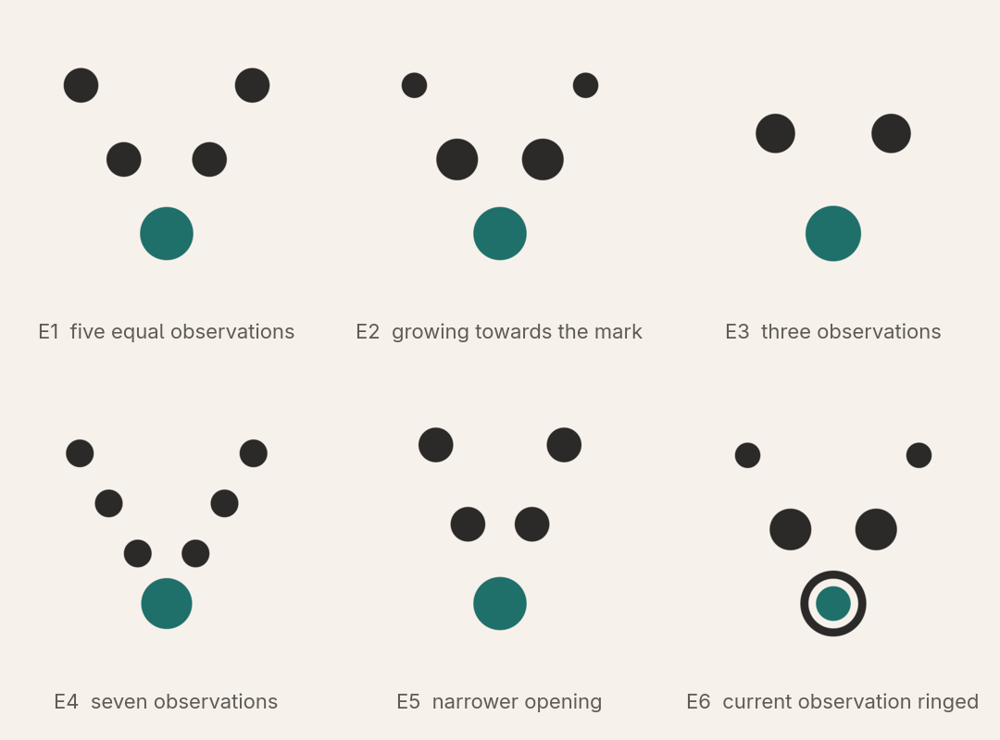
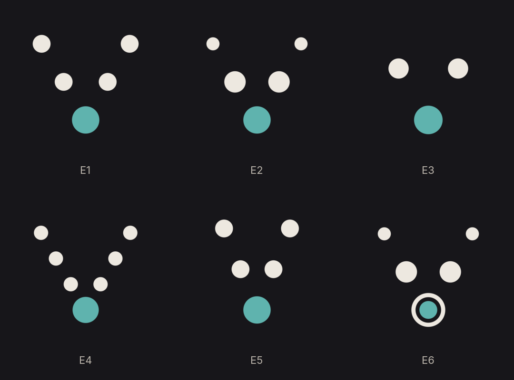
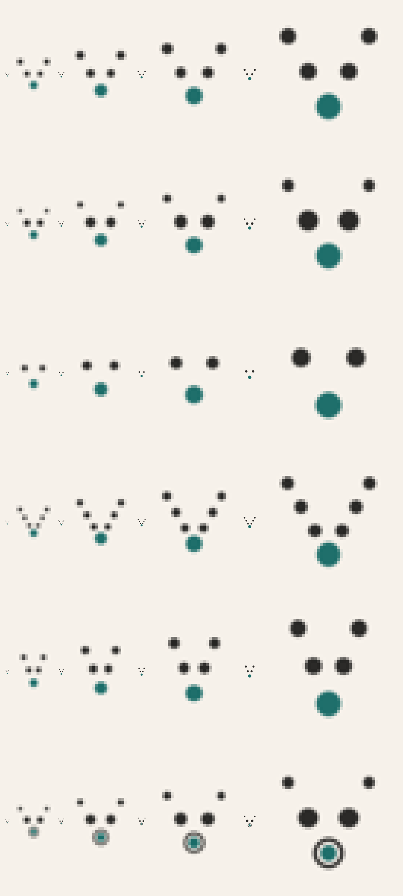
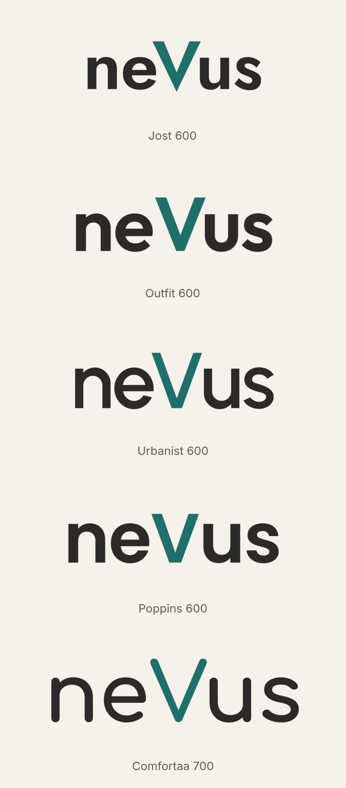
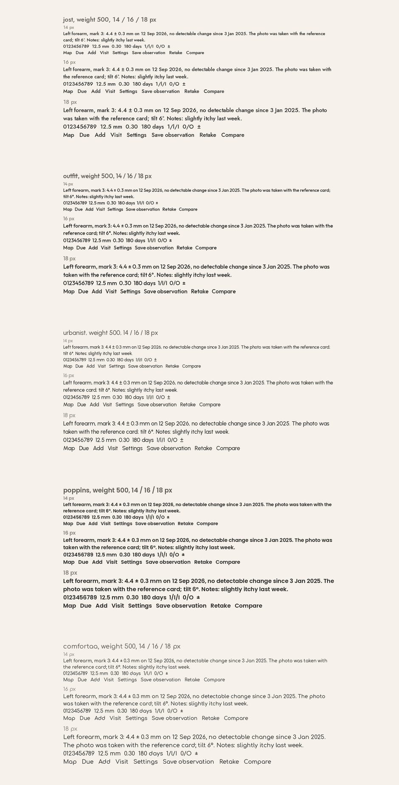
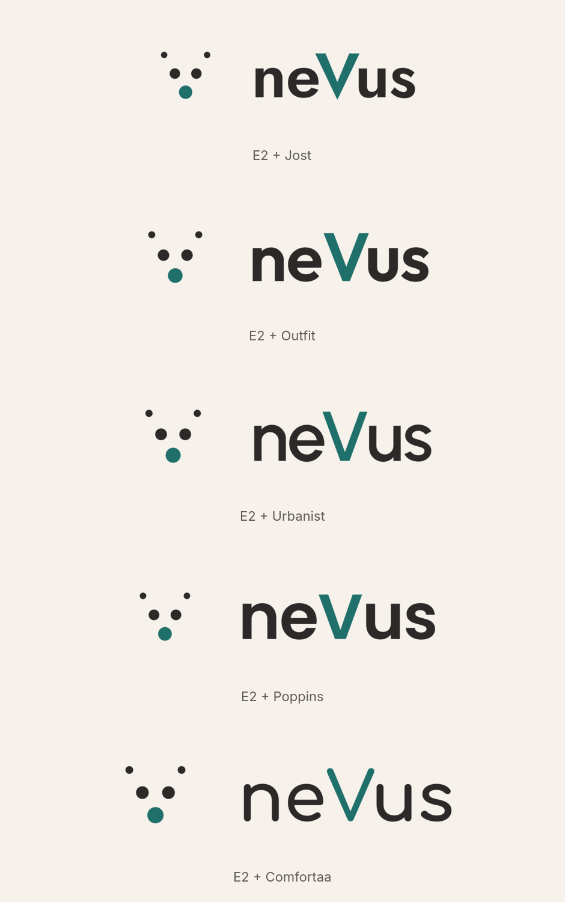
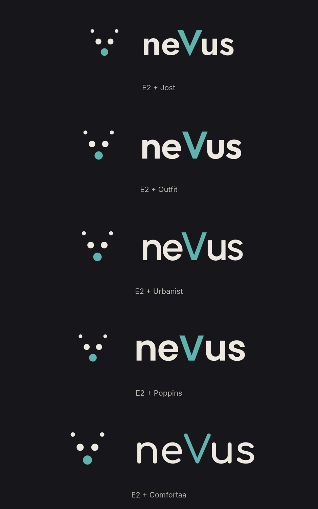

# Brand — round 3

**Brief for this round.** Direction E (observations forming a V that converges on the mark) was chosen; the client asked for variations of it and for wordmarks in typefaces with letterforms as symmetric as possible. Colours are approved and unchanged: paper `#F6F1EA`, ink `#2B2A28`, accent `#1F6F6B` (dark theme: `#17161A`, `#EDE8E0`, `#5FB3AE`). Everything must communicate observation and continuity, never diagnosis or emergency. Every mark must survive 16 px.

**What changed since round 2.** Marks are constructed parametrically on the 256 grid ([`sources/dots_v.py`](sources/dots_v.py)), symmetric to the pixel (mirror test: 0 differing pixels), with sizes that progress by area; each variant changes one parameter. Wordmarks are set with real shaping (kerning from the fonts), normalised to one cap height, and shown with text-size specimens because the wordmark face becomes the interface face. Lockups, dark variants and a real-size test are included.

## Marks

| Variant | What changes | Reading |
| --- | --- | --- |
| **E1** five equal | the round-2 sketch, reconstructed | five dated observations, one mark; even and quiet |
| **E2** growing | dot area grows towards the mark | time flows towards the present observation; the strongest reading of continuity |
| **E3** three | fewer dots | the small-size glyph: what E1 or E2 become at 16–24 px |
| **E4** seven | denser trail | more history, less air; reads as a chain at small sizes |
| **E5** narrower | V opens 44° instead of 60° | closer to a letter V, less like a constellation |
| **E6** ringed | the current observation carries a ring | "this one, now"; the ring costs legibility below 32 px |

Real size and enlarged pixels (16, 24, 32, 48 px), one row per variant in the same order:

Recommendation: **E2** as the mark, with **E3** as the glyph for 16–24 px (favicon, tab bar), because the growing series carries the idea of a record over time and the three-dot glyph keeps the same shape where five dots turn into noise.

## Wordmark

Five geometric typefaces (SIL Open Font License 1.1, self-hostable), set with kerning, normalised to a 100 px cap height, the V in the accent:

| Typeface | Weight | Why it is here |
| --- | --- | --- |
| Jost | 600 | Futura lineage: n and u are mirror images, V and s symmetric, e a cut circle; the most geometric |
| Outfit | 600 | even, generous round e and u; calm at display size and clear at text size |
| Urbanist | 600 | low-contrast geometric with a very regular rhythm; wide, stable V |
| Poppins | 600 | classic geometric with round counters; friendlier and a little heavier |
| Comfortaa | 700 | rounded, almost monoline; the softest letterforms, playful by nature |

Text-size specimens (14, 16, 18 px, weight 500) with measurements, numerals and interface labels:

## Lockups (E2 with each typeface)

Rules used: mark height 1.7 × cap height; horizontal gap equal to the x-height; the mark centred on the middle of the cap height. A stacked lockup is in [`lockups/`](lockups/) for the leading combination.

Recommendation: **Outfit** for wordmark and interface, because it keeps the symmetric skeleton the brief asks for while staying the most legible of the five at 14 px; **Jost** if the wordmark should look more classically geometric, pairing it with Outfit for interface text.

## Sources

- Marks: [`svg/`](svg/) (light, dark and bare variants of E1–E6), generator [`sources/dots_v.py`](sources/dots_v.py).
- Wordmarks: [`wordmarks/`](wordmarks/) (paper, transparent and dark versions plus metrics JSON).
- Lockups: [`lockups/`](lockups/).
- Boards: [`boards/`](boards/).

## Decision requested

1. Mark variant: E2 with E3 as small glyph (recommended), or another variant.
2. Typeface: Outfit (recommended), Jost, Urbanist, Poppins or Comfortaa.
