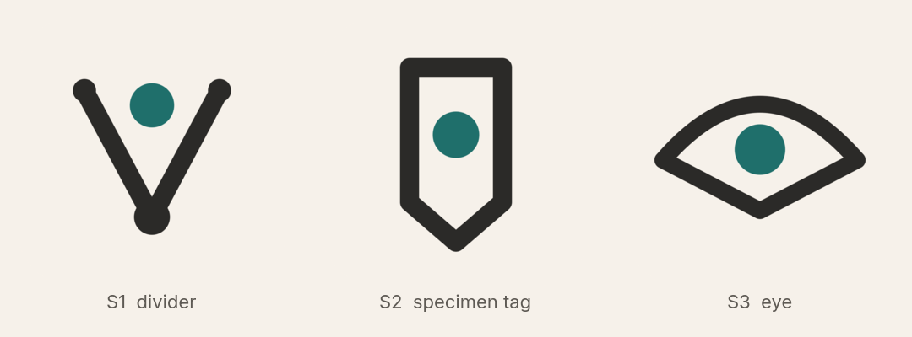
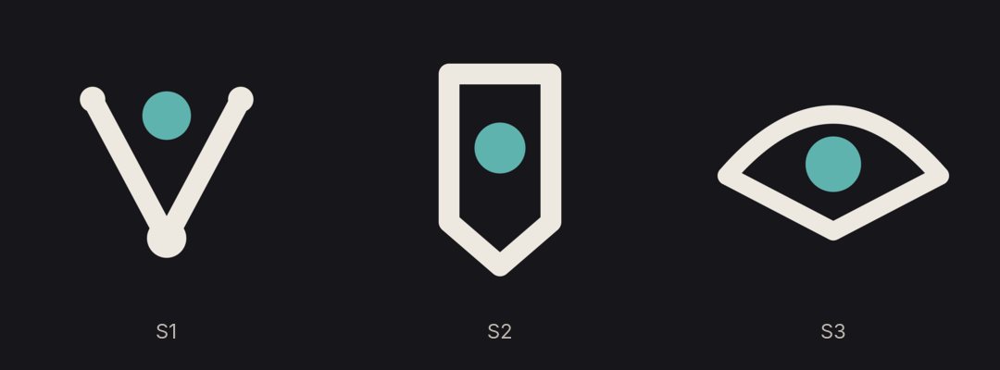
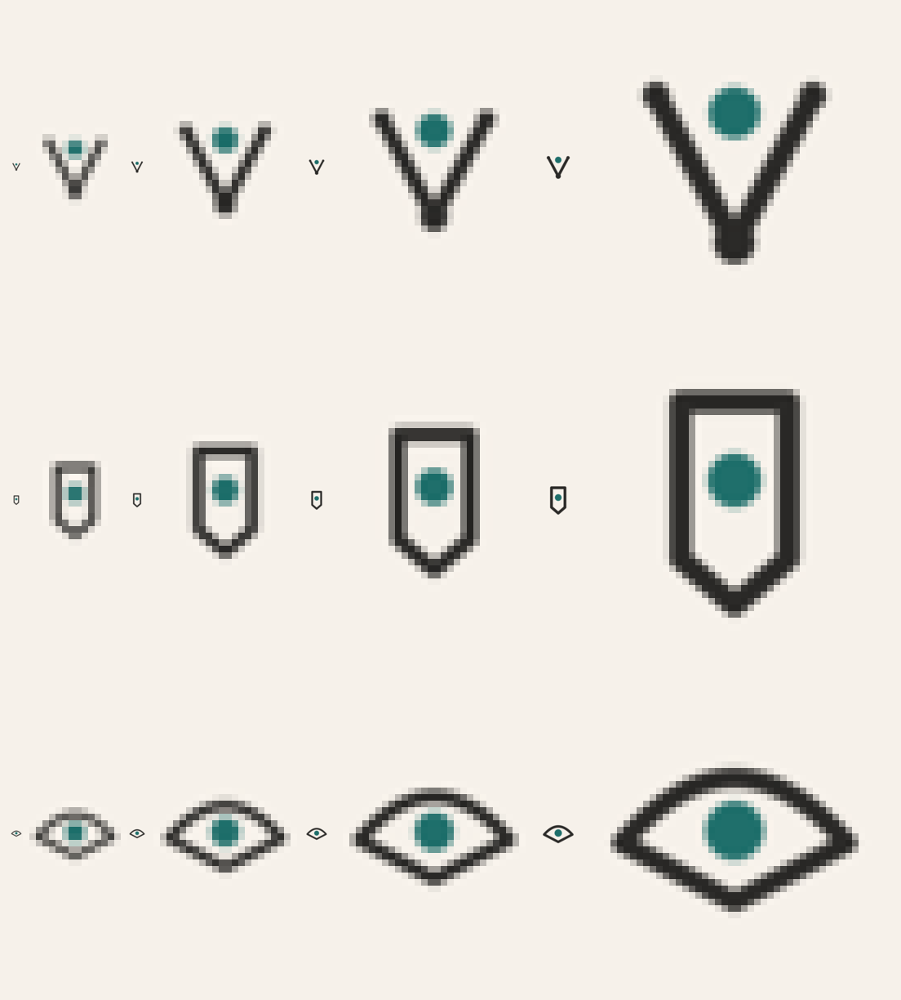
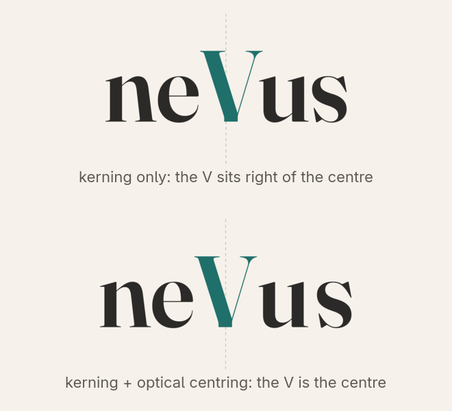
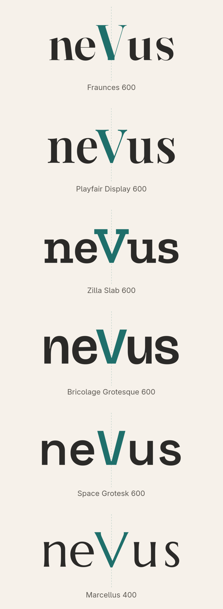
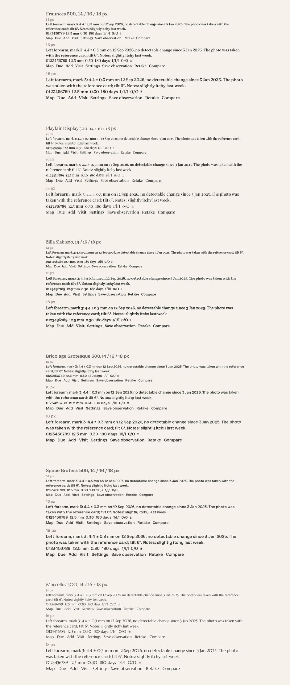
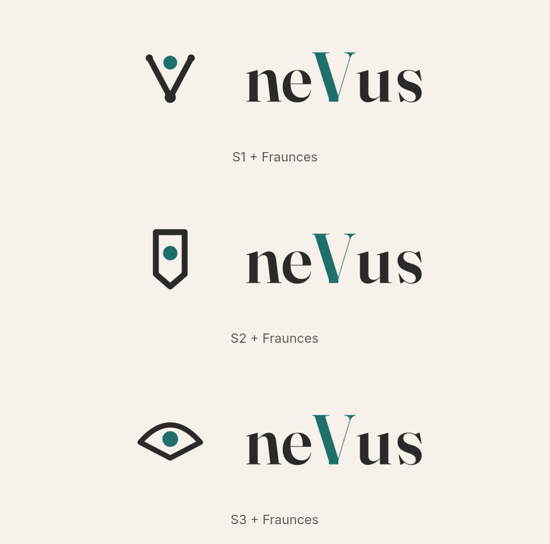
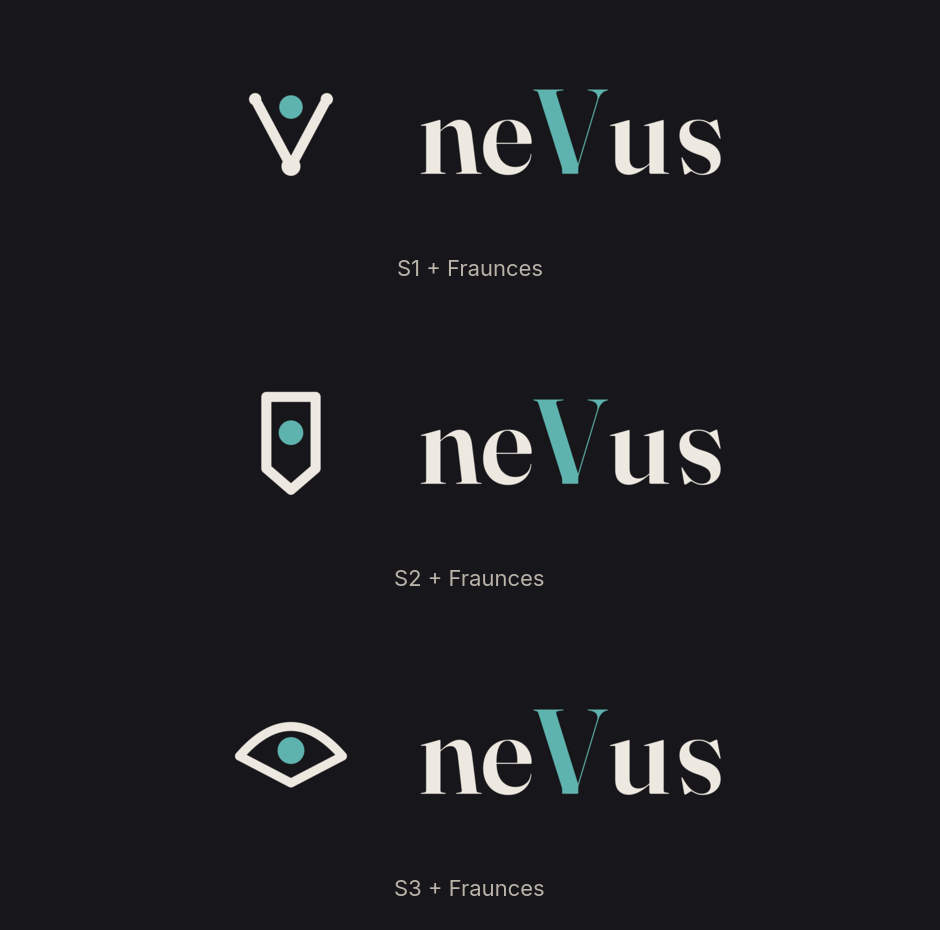

# Brand — round 4

**Brief for this round.** Round 3 was declined: none of the dot-V variants, and the wordmark's V looked displaced because "ne" is wider than "us". The client asked for a fresh start on the symbol, for the V to sit at the true centre, and for typefaces with "more style and personality of their own, without losing the formal touch". Colours are approved and unchanged: paper `#F6F1EA`, ink `#2B2A28`, accent `#1F6F6B` (dark theme `#17161A`, `#EDE8E0`, `#5FB3AE`). Everything must communicate observation and continuity, never diagnosis or emergency, and survive 16 px.

**What changed.** Three new symbol concepts, none of them dots or rings: an instrument, a label and an eye, each symmetric to the pixel (mirror test: 0 differing pixels). The wordmark is now **optically centred**: after shaping with the font's kerning, the ink from the left edge to the V's centre and from the V's centre to the right edge are measured and equalised by distributing the difference into the gaps of the narrower half, so the V is the exact centre of the word ([proof below](#the-v-at-the-centre)). Typefaces were surveyed from open-licence sources with character (29 candidates) and six are shown across families: soft serif, high-contrast serif, slab, two grotesques with character, and an inscriptional roman. Fonts from sites such as dafont are mostly licensed for personal use only and cannot ship inside a self-hosted AGPL application; every candidate here is under the SIL Open Font License 1.1, which allows bundling and self-hosting.

## Symbols

| Symbol | Idea | Reading |
| --- | --- | --- |
| **S1 divider** | a measuring compass whose points hold the mark between them; the legs are the V, the hinge is the base | measure, do not guess; instrument-like, technical and formal |
| **S2 tag** | a specimen label whose lower end is the V, the mark on the label | on the record; documentary, quiet, formal |
| **S3 eye** | an eye whose lower lid is the V, the mark as the pupil | observation; the most iconic and the most personal of the three |

Real size and enlarged pixels at 16, 24, 32 and 48 px, one row per symbol in the same order:

All three keep their shape at 16 px without a simplified glyph.

## The V at the centre

The same wordmark (Fraunces) with kerning only, and with kerning plus optical centring. The dashed line is the centre of the box; the values behind it are 178 px of ink to the left of the V's centre against 163 px to the right before centring.

## Wordmark

Six typefaces with character, formal enough for a health record, set with kerning, normalised to a 100 px cap height and optically centred on the V; the dashed line shows the centre.

| Typeface | Weight | Licence | Character | Interface text |
| --- | --- | --- | --- | --- |
| **Fraunces** | 600 | SIL OFL 1.1 | soft, slightly wonky old-style serif; warm and formal at once | yes: optical-size axis gives a proper text cut at 14–18 px |
| **Playfair Display** | 600 | SIL OFL 1.1 | high-contrast transitional serif; elegant and formal | display only; hairlines too thin at 14 px, pair with a text face |
| **Zilla Slab** | 600 | SIL OFL 1.1 | slab serif with a technical, editorial voice | yes: sturdy at 14 px |
| **Bricolage Grotesque** | 600 | SIL OFL 1.1 | grotesque with quirks (the wide V, the narrow e); formal but not neutral | yes: optical-size axis |
| **Space Grotesk** | 600 | SIL OFL 1.1 | technical grotesque with distinctive letterforms | yes |
| **Marcellus** | 400 | SIL OFL 1.1 | inscriptional roman; the most classical and formal | display only; one weight, pair with a text face |

Text-size specimens (14, 16, 18 px, weight 500 where the font is variable) with measurements, numerals and interface labels:

## Lockups

Each symbol with Fraunces, light and dark (mark height 1.7 × cap height, gap equal to the x-height, mark centred on the cap height):

## Recommendation

- **Symbol: S3 eye**, because observation is the product's whole point, the mark has real personality, and it is the one people will recognise at a glance in a tab bar. **S1 divider** is the alternative if the brand should lean towards measurement rather than observation.
- **Typeface: Fraunces** for wordmark and interface: it has an unmistakable personality, stays formal, and its optical-size axis produces a genuine text face for the interface and the reports. **Zilla Slab** if a technical voice is preferred; **Bricolage Grotesque** if a sans is preferred.

## Decision requested

1. Symbol: S3 eye (recommended), S1 divider, S2 tag, or none.
2. Typeface: Fraunces (recommended), Zilla Slab, Bricolage Grotesque, Space Grotesk, Playfair Display or Marcellus.

## Sources

- Symbols: [`svg/`](svg/) (light, dark and bare variants), generator [`sources/symbols.py`](sources/symbols.py).
- Wordmarks: [`wordmarks/`](wordmarks/) (paper, guide, transparent and dark versions plus metrics JSON with the centring values).
- Lockups: [`lockups/`](lockups/). Boards: [`boards/`](boards/).
