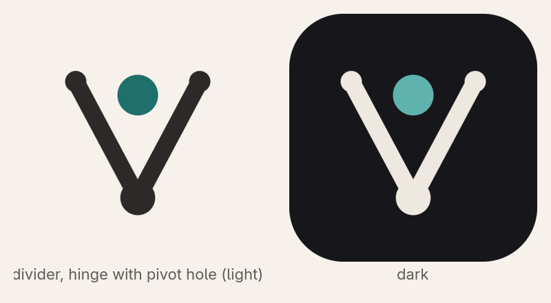
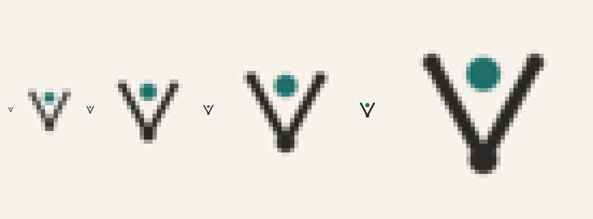
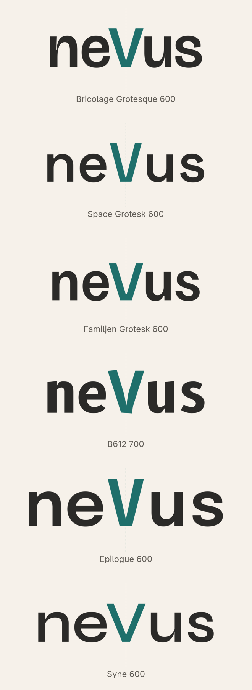
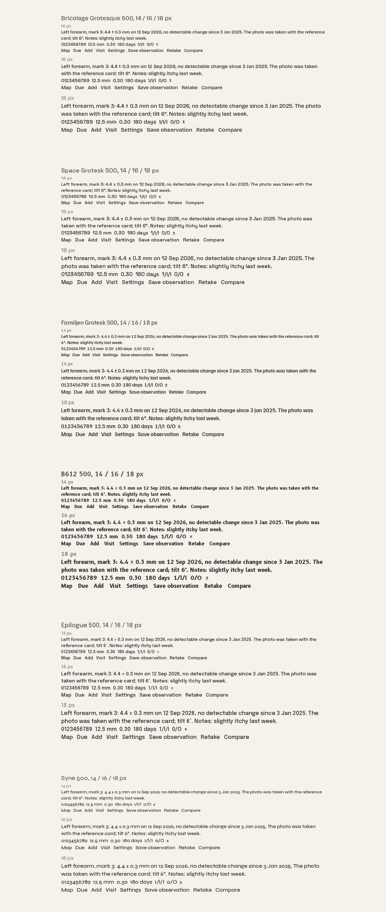
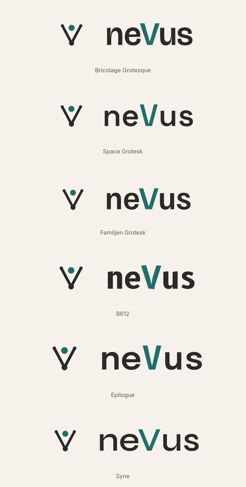
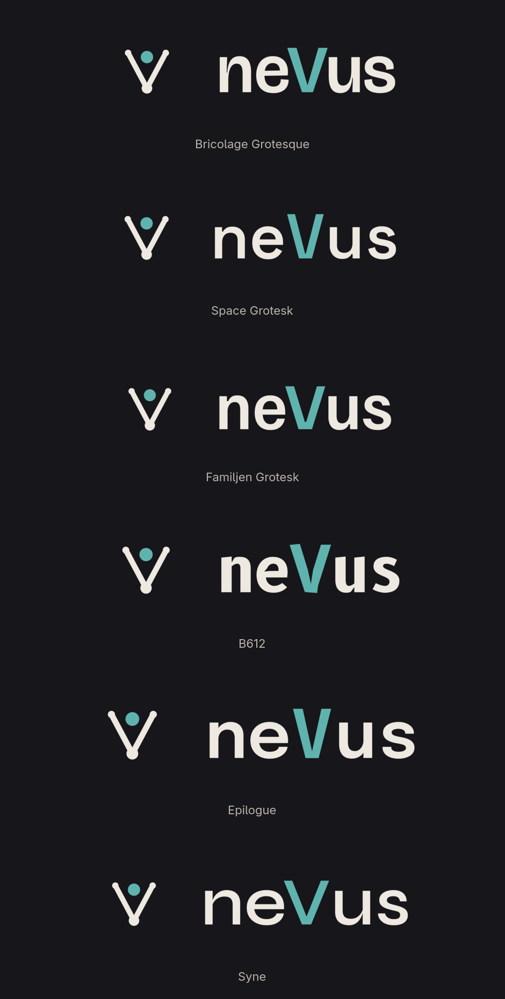
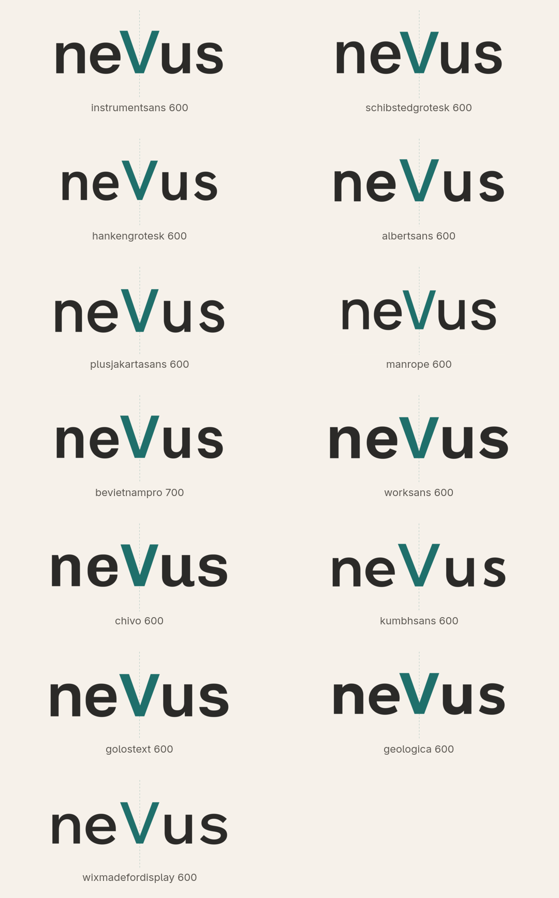
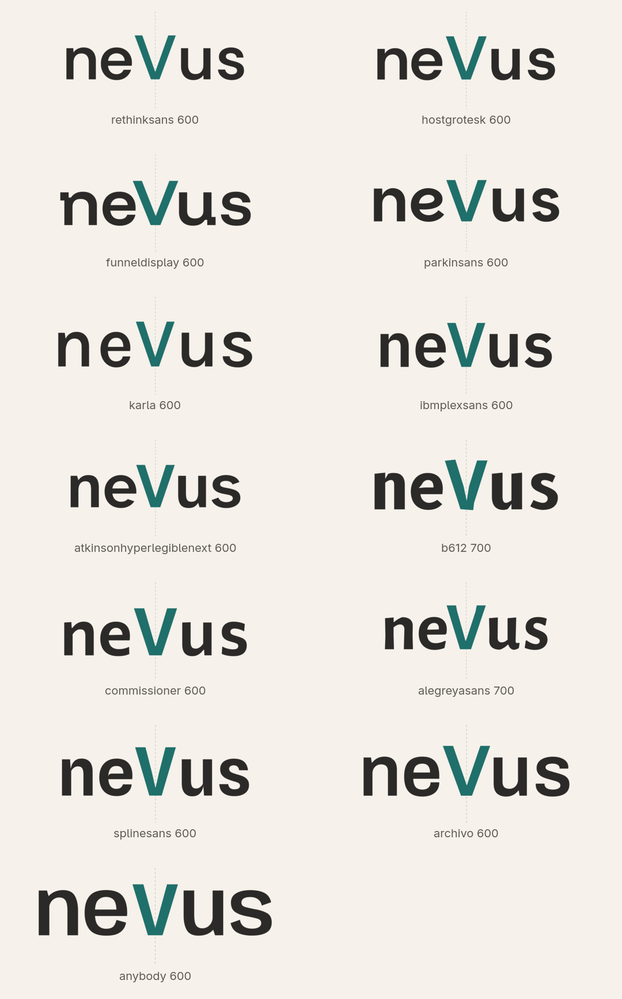
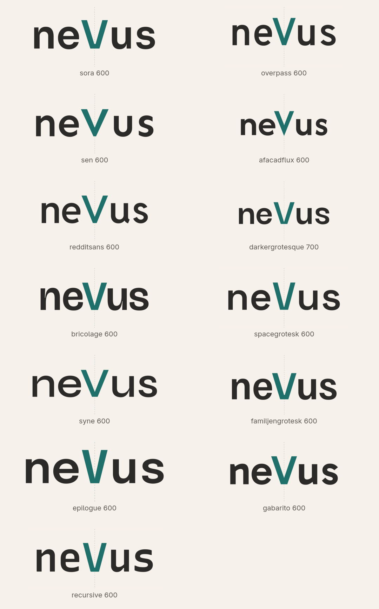

# Brand — round 5: the symbol settled, the typeface in sans

**Decisions so far.** The symbol is **S1, the divider** (a measuring compass whose points hold the mark between them). The client praised the optical centring of the V and asked for **sans-serif** typefaces with personality of their own and a formal touch, and for the divider's hinge to carry a circle in the inverse colour of the strokes.

## Symbol, version 2

The hinge at the vertex now carries a pivot hole in the background colour, drawn as a ring so the mark works on any surface; everything else is unchanged (256 grid, stroke 18, round caps and joins, symmetric to the pixel).

At 16, 24, 32 and 48 px (the hole closes below 32 px, as a real pivot would at that distance; the silhouette stays the same):

Source: [`sources/divider.py`](sources/divider.py); files in [`svg/`](svg/) (light, dark and bare variants).

## Wordmark in sans-serif

Thirty-nine sans-serif typefaces with character were surveyed as centred wordmarks (appendix below). Six are shown, chosen for personality with a formal register, one voice each: an editorial grotesque with quirks, a technical grotesque, a Scandinavian grotesque with sharp cuts, an instrument face, a wide sturdy grotesque, and a stylised geometric. All are under the SIL Open Font License 1.1 and self-hostable; every V is optically centred (dashed line).

| Typeface | Weight | Character | Interface text |
| --- | --- | --- | --- |
| **Bricolage Grotesque** | 600 | editorial grotesque with quirks: the wide V, the narrow e, the tucked s; formal but never neutral | yes: optical-size axis (12–96), width axis |
| **Space Grotesk** | 600 | technical grotesque with distinctive s and e; the voice of an instrument panel | yes |
| **Familjen Grotesk** | 600 | Scandinavian grotesque with sharp diagonal cuts; crisp and calm | yes |
| **B612** | 700 | designed for aircraft cockpit displays; unusual letterforms built for legibility; the natural match for a measuring instrument | yes: made for small sizes |
| **Epilogue** | 600 | wide, sturdy grotesque with presence; formal and confident | yes (weights 100–900) |
| **Syne** | 600 | stylised geometric with unusual proportions; the most fashion-forward, the least neutral | display first; text at 16 px and above |

Text-size specimens (14, 16, 18 px, weight 500 where the font is variable):

## Lockups with the divider

Mark height 1.7 × cap height, gap equal to the x-height, mark centred on the cap height; a stacked lockup is in [`lockups/`](lockups/).

## Recommendation

**Bricolage Grotesque** for wordmark and interface: it has a personality you recognise (the V alone is a signature), it stays formal, and its optical-size axis gives a proper text cut for the interface and the reports. **Space Grotesk** if the brand should sound more technical; **B612** if the instrument metaphor should run all the way into the letters.

## Decision requested

Typeface: Bricolage Grotesque (recommended), Space Grotesk, B612, Familjen Grotesk, Epilogue, Syne, or any face from the appendix.

## Appendix: the sans-serif survey

All thirty-nine candidates, centred, in the order they were reviewed.

## Sources

- Symbol: [`svg/`](svg/), [`sources/divider.py`](sources/divider.py).
- Wordmarks: [`wordmarks/`](wordmarks/) (paper, guide, transparent and dark versions plus metrics JSON).
- Lockups: [`lockups/`](lockups/). Boards: [`boards/`](boards/). Survey sheets: [`survey/`](survey/).
